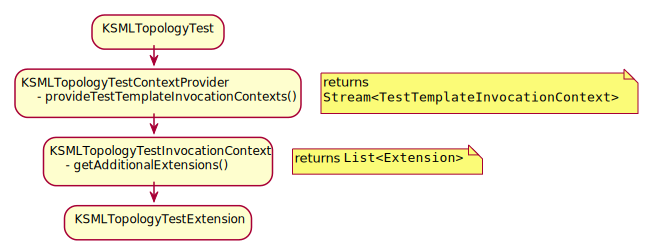

<!-- _class: lead  -->
# JUnit5 extensions
### for fun and profit

---
## About this talk

* About how (and why) to write JUnit5 extensions
* Uses @KSMLTestExtension as an example
* We'll skip over KSML internals where we can

---
## The challenge
```yaml
streams:
  test_input:
    topic: input_topic
  test_output:
    topic: output_topic

pipelines:
  main:
    from: test_input
    via:
      - type: mapKey
        mapper:
          code: |
            return key[:4].upper()
          resultType: string
    to: test_output

```
<!-- 
* We would like automated tests for this
* There are a lot of KSML operations
* some have multiple variants: code, expression
-->
---
### Solution: Kafka TopologyTestDriver
```java
    final var uri = ClassLoader.getSystemResource("pipelines/test-copying.yaml").toURI();
    final var path = Paths.get(uri);
    final var definition = YAMLObjectMapper.INSTANCE.readValue(Files.readString(path), JsonNode.class);
    final var definitions = ImmutableMap.of("definition",
            new TopologyDefinitionParser("test").parse(ParseNode.fromRoot(definition, "test")));
    var topologyGenerator = new TopologyGenerator("some.app.id");
    final var topology = topologyGenerator.create(streamsBuilder, definitions);

    try (TopologyTestDriver driver = new TopologyTestDriver(topology)) {
        var inputTopic = driver.createInputTopic("test_input", new StringSerializer(), new StringSerializer());
        var outputTopic = driver.createOutputTopic("test_output", new StringDeserializer(), new StringDeserializer());
        inputTopic.pipeInput("key1", "value1");
        var keyValue = outputTopic.readKeyValue();
        
        // do asserts on the topic contents
    }
```
* boilerplate obscuring the test intent (more if using AVRO)
* boilerplate not easily generalized
<!--
All KSML does is create a Kafka Streams topology, in test setup we can call these KSML parsing classes.
Once we have the topology, we could use TopologyTestDriver to put some data through and verify thet 
the pipeline does what we want. 
However there is quite a bit of boilerplate code that is not easy to generalize. Considering creating a 
superclass but that idea won't fly.
-->
---
### Could we use an extension to:

* verify test is running on GraalVM
* set up some data notations
* set up AVRO schema directory if desired
* get the KSML file, load it and create topology
* create a topology test driver for the topology
* create TestInputTopic, TestOutputTopic instances
* set variable references so that the test can use them

---
### JUnit5 extensions

Extension points related to certain events in test execution
Five main types of callback interfaces:
* <span style="color: red">conditional test execution</span>
* <span style="color: red">lifecycle callbacks</span>
* test instance post processing
* parameter resolution
* exception handling

```java
public class KSMLTestExtension implements ExecutionCondition, BeforeAllCallback, BeforeEachCallback, AfterEachCallback
```
<!-- 
There are 5 main types of extension points. For our extension, we are interested in
* conditional test execution: the tests only run on GraalVM.
* lifecycle callbacks so we can set the test driver up before the test, and clean up afterwards.
-->

---
<!-- _class: two-columns -->
### Passing information to the extension
Custom annotations for KSML test methods
```java
@Retention(RetentionPolicy.RUNTIME)
@Target(ElementType.METHOD)
@Test
public @interface KSMLTest {

    String NO_SCHEMAS = "";

    String topology();

    String schemapath() default NO_SCHEMAS;

    KSMLTopic[] inputTopics();

    KSMLTopic[] outputTopics();

    String testDriverRef() default "";
}
```

```java
@Retention(RetentionPolicy.RUNTIME)
@Target(ElementType.PARAMETER)
public @interface KSMLTopic {

    String variable();

    String topic();

    SerdeType keySerde() default SerdeType.STRING;

    SerdeType valueSerde() default SerdeType.STRING;

    enum SerdeType { STRING, AVRO }
}

```
<!-- 
Adding a custom annotation so we can tell the extension which KSML file to load, and which topics to 
attach to which variable. Note @Target(PARAMETER) on the right so KSMLTopic on the left has multiple fields.
-->
---
### How this will look in practice
```java
    TestInputTopic inputTopic;

    TestOutputTopic output0;

    TestOutputTopic output1;

    @KSMLTest(topology = "pipelines/test-routing.yaml",
            inputTopics = {@KSMLTopic(variable = "inputTopic", topic = "test_input")},
            outputTopics = {@KSMLTopic(variable = "output0", topic = "test_output0"),
                            @KSMLTopic(variable = "output1", topic = "test_output1")
            }
    )
    void testRouting() {
```

---
### Conditional test execution
Verify that the test is running on GraalVM.
```java
    @Override
    public ConditionEvaluationResult evaluateExecutionCondition(final ExtensionContext extensionContext) {
        if (extensionContext.getTestMethod().isEmpty()) {
            // at class level verification
            log.debug("Check for GraalVM");
            if (Version.getCurrent().isRelease()) {       
                return ConditionEvaluationResult.enabled("running on GraalVM");
            }
            log.warn("KSML tests need GraalVM to run, test disabled");
            extensionContext.publishReportEntry("KSML tests need GraalVM, test disabled");
            return ConditionEvaluationResult.disabled("KSML tests need GraalVM to run");
        }
        return ConditionEvaluationResult.enabled("on method");
    }

```
<!-- 
This extension point gets called once for the test class, and once for each test method. We're checking on the
global level, and disable the test as a whole if not on Graal.
-->

---
### Lifecycle callbacks
Set up some data notations (one time)
```java
    @Override
    public void beforeAll(ExtensionContext extensionContext) {
        log.debug("registering notations");
        final var jsonNotation = new JsonNotation();
        NotationLibrary.register(BinaryNotation.NOTATION_NAME, new BinaryNotation(jsonNotation::serde), null);
        NotationLibrary.register(JsonNotation.NOTATION_NAME, jsonNotation, new JsonDataObjectConverter());
        NotationLibrary.register(MockAvroNotation.NOTATION_NAME, avroNotation, null);
    }
```
<!-- 
Here we set up some KSML internals
-->

---
#### Lifecycle callbacks (continued)
```java
    @Override
    public void beforeEach(ExtensionContext extensionContext) throws Exception {
        StreamsBuilder streamsBuilder = new StreamsBuilder();
        if (extensionContext.getTestMethod().isEmpty()) {
            return;   // not at method level
        }
        // get the annotation on the method
        Method method = extensionContext.getTestMethod().get();
        String methodName = method.getName();
        KSMLTest ksmlTest = method.getAnnotation(KSMLTest.class);
        if (ksmlTest == null) {
            return;     // not a KSML test method
        }
        // get the KSML definition classpath relative path and load the topology into the test driver
        String topologyName = ksmlTest.topology();
        log.debug("loading topology {}", topologyName);
        final var uri = ClassLoader.getSystemResource(topologyName).toURI();
        final var path = Paths.get(uri);
        final var definition = YAMLObjectMapper.INSTANCE.readValue(Files.readString(path), JsonNode.class);
        final var definitions = ImmutableMap.of("definition",
                new TopologyDefinitionParser("test").parse(ParseNode.fromRoot(definition, methodName)));
        var topologyGenerator = new TopologyGenerator(methodName + ".app");
        final var topology = topologyGenerator.create(streamsBuilder, definitions);
```
---
### Lifecycle callbacks (continued)
Create test driver, input and output topics, set variables
```java
    topologyTestDriver = new TopologyTestDriver(topology);

    // create in- and output topics and assign them to variables in the test
    Class<?> testClass = extensionContext.getRequiredTestClass();
    Object testInstance = extensionContext.getRequiredTestInstance();
    for (KSMLTopic ksmlTopic: ksmlTest.inputTopics()) {
        // use reflection to find and set variables in the test 
        log.debug("set variable {} to topic {}", ksmlTopic.variable(), ksmlTopic.topic());
        Field inputTopicField = testClass.getDeclaredField(ksmlTopic.variable());
        inputTopicField.setAccessible(true);
        inputTopicField.set(testInstance, 
            topologyTestDriver.createInputTopic(ksmlTopic.topic(), 
                                                getKeySerializer(ksmlTopic), 
                                                getValueSerializer(ksmlTopic)));
        modifiedFields.add(inputTopicField);
    }
```
---
### Lifecycle callbacks (continued)
After the test, clean up after ourselves!
```java
    @Override
    public void afterEach(ExtensionContext context) throws Exception {
        if (context.getTestMethod().isEmpty()) {
            return;
        }
        Method method = context.getTestMethod().get();
        var annotation = method.getAnnotation(KSMLTest.class);
        if (annotation == null) {
            return;        // not a KSML test
        }

        // clear any set fields
        var testInstance = context.getRequiredTestInstance();
        for (Field field: modifiedFields) {
            field.setAccessible(true);
            field.set(testInstance, null);
        }
        modifiedFields.clear();
    }
```
---
### First working iteration of extension
```java
@ExtendWith(KSMLTestExtension.class)
public class KSMLRoutingTest {

    TestInputTopic inputTopic;

    TestOutputTopic output0;

    TestOutputTopic output1;

    @KSMLTest(topology = "pipelines/test-routing.yaml",
            inputTopics = {@KSMLTopic(variable = "inputTopic", topic = "test_input")},
            outputTopics = {@KSMLTopic(variable = "output0", topic = "test_output0"),
                            @KSMLTopic(variable = "output1", topic = "test_output1")
            }
    )
    void testRouting() {
        // write data to inputTopic, verify output topics
```
Works, but verbose annotation and duplicated names
<!-- 
This solution works but the annotation becomes unwieldy. Also the string argument "topic" has to line
up with the variable names, which can be error prone. Adding AVRO and a TopologyTestDriver reference does not help
-->

---
### Second iteration of extension
Annotate the variables, and let the extension handle the annotations
```java
@ExtendWith(KSMLTestExtension.class)
public class KSMLRoutingTest {

    @KSMLTopic(topic = "test_input")
    TestInputTopic<String, String> inputTopic;

    @KSMLTopic(topic = "test_output0")
    TestOutputTopic<String, String> output0;

    @KSMLTopic(topic = "test_output1")
    TestOutputTopic<String, String> output1;

    @KSMLTest(topology = "pipelines/test-routing.yaml")
    void testRouting() {
        // write data to inputTopic, verify output topics
```
Much nicer! 
<!-- 
The basic processing of the extension has not changed. It's now using reflection to find variables
of type TestInputTopic and TestOutputTopic and checking if they are annotated. Same for TopologyTestDriver.
-->

---
### Wait, but there's one more thing...

* TMTOWTDI - There's more than one way to do things in KSML
* operation aliases and `expression` vs `code` for example
* we can only test one definition per test method
* could we have parameterized KSML tests?
```java
    @KSMLTopologyTest(
            topologies = {
                    "pipelines/test-mapvalue-expression.yaml",
                    "pipelines/test-mapvalues-expression.yaml",
                    "pipelines/test-transformvalue-expression.yaml",
                    "pipelines/test-mapvalues-code.yaml",
                    "pipelines/test-transformvalue-code.yaml"},
            schemaDirectory = "schemas")
    @DisplayName("Values can be mapped with mapValue and aliases")
    void testMapValueByExpression() {

```
---
### Annotation for parameterized tests
```java
@Target({ElementType.ANNOTATION_TYPE, ElementType.METHOD})
@Retention(RetentionPolicy.RUNTIME)
@TestTemplate
@ExtendWith(KSMLTopologyTestContextProvider.class)
public @interface KSMLTopologyTest {

    String NO_SCHEMAS = "";
    String NO_MODULES = "";

    String[] topologies();

    String schemaDirectory() default NO_SCHEMAS;

    String modulesDirectory() default NO_MODULES;

}

```
<!-- 
The main thing about the annotation is the addition of KSMLTopologyTestContextProvider.
This kicks off a multi step process illustrated in the following slide
-->

---
<!-- _class: centered-image -->
### Steps to set up parameterized tests



---
### create TestTemplateInvocationContext
```java
@Slf4j
public class KSMLTopologyTestContextProvider implements TestTemplateInvocationContextProvider {

    @Override
    public boolean supportsTestTemplate(final ExtensionContext context) {
        log.debug("Checking for KSMLTopologyTest annotation");
        return isAnnotated(context.getTestMethod(), KSMLTopologyTest.class);
    }

    @Override
    public Stream<TestTemplateInvocationContext> provideTestTemplateInvocationContexts(final ExtensionContext context) {
        // A new extension instance will be created each time: 
        //    one time variable scanning (@KSMLTopic etc) now happens here.
        //    data is passed on in KSMLTopologyTestInvocationContext instances

        return Arrays.stream(ksmlTopologyTest.topologies())
        .map(topologyName -> 
           new KSMLTopologyTestInvocationContext(topologyName, schemaDirectory, modulesDirectory, inputTopics, outputTopics, testDriverRef)
        );


```
<!-- 
Processing is different since a new extension is created for every onvocation, but we want to 
keep the reflection usage one time only. So we move it here and pass the found data on in invocation contexts.
The logic to extract the data is similar to the test extension shown above.
-->

---
### adding the extension on the fly

```java
public record KSMLTopologyTestInvocationContext(...) implements TestTemplateInvocationContext {

    @Override
    public String getDisplayName(final int invocationIndex) {
        return invocationIndex + ": " + topologyName;
    }

    @Override
    public List<Extension> getAdditionalExtensions() {
        return List.of(new KSMLTopologyTestExtension(schemaDirectory, modulesDirectory, topologyName, 
                                                     inputTopics, outputTopics, testDriverRef));
    }
```

```java
public class KSMLTopologyTestExtension implements ExecutionCondition, BeforeEachCallback, AfterEachCallback {
```
<!-- 
Finally the test invocation context adds the test extension on the fly.
Since we already did all the reflection calls we just pass the needed data as
constructor arguments.
The actual extension processing (testdriver setup, etcetera) is the same as before.
-->

---
### Summary
#### "for fun and profit"?
<!-- 
Should you go to the trouble of writing your own extension?
Readability matters
Consider if there is a lot of boilerplate, or long repeated @BeforeEach etc in multiple tests
Results: profit - tests are more readable, express intent better, and are easier to write.
         fun - learning about extensions and having a better time testing
-->
* more readable tests
* easier to write tests
* learning about extensions

 ---
 <!-- _class: lead -->
 # Thank You

 
